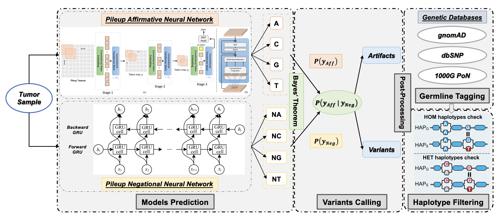

# ClairS-TO - a deep-learning method for tumor-only somatic small variant calling

[](https://opensource.org/licenses/BSD-3-Clause)

Contact: Ruibang Luo, Zhenxian Zheng, Lei Chen  
Email: {rbluo,zxzheng,lchen}@cs.hku.hk 

------

## Introduction

ClairS-TO (Somatic Tumor-Only) is a tool in the Clair series to support long-read somatic small variant calling with only tumor samples available.

Without a normal sample, non-somatic noises cannot be identified by finding common signals between a paired tumor and normal. The variant caller itself needs to be more proficient in telling noises from somatic signals.

In ClairS-TO, we use an ensemble of two neural networks with opposite objectives. With the same input, an Affirmative NN determines how likely a candidate is a somatic variant - P(*Y<sub>Aff</sub>*), and a Negational NN determines how likely a candidate is NOT a somatic variant - P(*Y<sub>Neg</sub>*). A conditional probability P(*Y<sub>Aff</sub>* | *Y<sub>Neg</sub>*) that determines how likely a candidate is a somatic variant given that the probability that the candidate is not a somatic variant is calculated from the probability of both networks. A somatic variant candidate that doesn't look like a noise usually has a high P(*Y<sub>Aff</sub>*) but a low P(*Y<sub>Neg</sub>*), while a somatic variant candidate that can also be a noise can have both a high P(*Y<sub>Aff</sub>*) and a high P(*Y<sub>Neg</sub>*).

Below is a workflow of ClairS-TO.


Like other tumor-only somatic variant callers, ClairS-TO accepts public databases (i.e., gnomAD, dbSNP, and 1000G PoN) and private PoN as input to remove non-somatic variants.

For somatic variant calling using paired tumor/normal samples, please try [ClairS](https://github.com/HKU-BAL/ClairS).

------

## Contents
- [Latest Updates](#latest-updates)
- [Installation](#installation)
  - [Option 1. Docker pre-built image](#option-1--docker-pre-built-image)
  - [Option 2. Singularity](#option-2-singularity)
  - [Option 3. Build an anaconda (or micromamba) virtual environment](#option-3-build-an-anaconda-or-micromamba-virtual-environment)
  - [Option 4. Docker Dockerfile](#option-4-docker-dockerfile)
- [Quick Demo](#quick-demo)
- [Pre-trained Models](#pre-trained-models)
- [Usage](#usage)
- [Tagging non-somatic variant using public databases](#tagging-non-somatic-variant-using-public-databases)
- [Disclaimer](#disclaimer)

------

## Latest Updates

*v0.0.1 (Nov., 2023)*: Initial release for early access.

---

## Quick Demo

- Oxford Nanopore (ONT) [Q20+](https://nanoporetech.com/q20plus-chemistry) data as input, see [ONT Quick Demo](docs/ont_quick_demo.md).
- PacBio HiFi Revio data as input, see [PacBio HiFi Quick Demo](docs/pacbio_hifi_quick_demo.md).
- Illumina NGS data as input, see [Illumina Quick Demo](docs/illumina_quick_demo.md).

### Quick start

After following [installation](#installation), you can run ClairS-TO with one command:

```bash
./run_clairs_to -T tumor.bam -R ref.fa -o output -t 8 -p ont_r10_guppy

## Final output file: output/output.vcf.gz
```

Check [Usage](#Usage) for more options.

------

## Pre-trained Models

ClairS-TO trained both Affirmative and Negational models using GIAB samples, and carry on benchmarking on HCC1395 tumor sample dataset. All models were trained with chr20 excluded (including only chr1-19, 21, 22). 

|  Platform   |        Model name         |      Chemistry /Instruments      | Basecaller | Option (`-p/--platform`) |   Reference   | Aligner  |
| :---------: |:-------------------------:|:--------------------------------:|:----------:| :-----------: | :------: | ----------- |
| ONT | r1041_e82_400bps_sup_v420 |          R10.4.1, 5khz           |   Dorado   | `ont_r10_dorado_5khz` | GRCh38_no_alt | Minimap2 |
| ONT | r1041_e82_400bps_sup_v410 |          R10.4.1, 4khz           |   Dorado   | `ont_r10_dorado_4khz` | GRCh38_no_alt | Minimap2 |
| ONT | r1041_e82_400bps_sup_g615 |              R10.4.1, 4khz             |   Guppy6   |   `ont_r10_guppy` | GRCh38_no_alt | Minimap2 |
|  Illumina   |           ilmn            |          NovaSeq/HiseqX          |     -      |          `ilmn`          |    GRCh38     | BWA-MEM  |
| PacBio HIFI |        hifi_revio         | Revio with SMRTbell prep kit 3.0 |     -      | `hifi_revio` | GRCh38_no_alt | Minimap2 |

------


## Installation

### Option 1.  Docker pre-built image

A pre-built docker image is available at [DockerHub](https://hub.docker.com/r/hkubal/clairs-to). 

**Caution**: Absolute path is needed for both `INPUT_DIR` and `OUTPUT_DIR` in docker. 

```bash
docker run -it \
  -v ${INPUT_DIR}:${INPUT_DIR} \
  -v ${OUTPUT_DIR}:${OUTPUT_DIR} \
  hkubal/clairs-to:latest \
  /opt/bin/run_clairs_to \
  --tumor_bam_fn ${INPUT_DIR}/tumor.bam \      ## use your tumor bam file name here
  --ref_fn ${INPUT_DIR}/ref.fa \               ## use your reference file name here
  --threads ${THREADS} \                       ## maximum threads to be used
  --platform ${PLATFORM} \                     ## options: {ont_r10_dorado_4khz, ont_r10_dorado_5khz, ont_r10_guppy, ilmn, hifi_revio}
  --output_dir ${OUTPUT_DIR}                   ## output path prefix 
```

Check [Usage](#Usage) for more options.

### Option 2. Singularity

**Caution**: Absolute path is needed for both `INPUT_DIR` and `OUTPUT_DIR` in singularity. 

```bash
INPUT_DIR="[YOUR_INPUT_FOLDER]"        # e.g. /home/user1/input (absolute path needed)
OUTPUT_DIR="[YOUR_OUTPUT_FOLDER]"      # e.g. /home/user1/output (absolute path needed)
mkdir -p ${OUTPUT_DIR}

conda config --add channels defaults
conda create -n singularity-env -c conda-forge singularity -y
conda activate singularity-env

# singularity pull docker pre-built image
singularity pull docker://hkubal/clairs-to:latest

# run the sandbox like this afterward
singularity exec \
  -B ${INPUT_DIR},${OUTPUT_DIR} \
  clairs-to_latest.sif \
  hkubal/clairs-to:latest \
  /opt/bin/run_clairs_to \
  --tumor_bam_fn ${INPUT_DIR}/tumor.bam \      ## use your tumor bam file name here
  --ref_fn ${INPUT_DIR}/ref.fa \               ## use your reference file name here
  --threads ${THREADS} \                       ## maximum threads to be used
  --platform ${PLATFORM} \                     ## options: {ont_r10_dorado_4khz, ont_r10_dorado_5khz, ont_r10_guppy, ilmn, hifi_revio}
  --output_dir ${OUTPUT_DIR} \                 ## output path prefix
  --conda_prefix /opt/conda/envs/clairs-to
```

### Option 3. Build a micromamba (or anaconda) virtual environment

Check here to install the tools step by step.

**Use micromamba (recommended)**:

Please install micromamba using the official [guide](https://mamba.readthedocs.io/en/latest/micromamba-installation.html) or using the commands below:

```bash
wget -O linux-64_micromamba-1.5.1-2.tar.bz2 https://micro.mamba.pm/api/micromamba/linux-64/latest
mkdir micromamba
tar -xvjf linux-64_micromamba-1.5.1-2.tar.bz2 -C micromamba
cd micromamba
./bin/micromamba shell init -s bash -p .
source ~/.bashrc
```


**Or use anaconda**:

Please install anaconda using the official [guide](https://docs.anaconda.com/anaconda/install) or using the commands below:

```bash
wget https://repo.anaconda.com/miniconda/Miniconda3-latest-Linux-x86_64.sh
chmod +x ./Miniconda3-latest-Linux-x86_64.sh 
./Miniconda3-latest-Linux-x86_64.sh
```

**Install ClairS-TO using micromamba step by step:**

```bash
# create and activate an environment named clairs-to
# install pypy and packages in the environment
# for micromamba
micromamba create -n clairs-to -c bioconda -c pytorch -c conda-forge pytorch tqdm clair3-illumina bcftools einops python=3.9.0 -y
micromamba activate clairs-to

## for anaconda 
#conda create -n clairs-to -c bioconda -c pytorch -c conda-forge pytorch tqdm clair3-illumina bcftools einops python=3.9.0 -y
#source activate clairs-to

git clone https://github.com/HKU-BAL/ClairS-TO.git
cd ClairS-TO

# make sure in clairs-to environment
# download pre-trained models
echo ${CONDA_PREFIX}
mkdir -p ${CONDA_PREFIX}/bin/clairs-to_models
mkdir -p ${CONDA_PREFIX}/bin/clairs-to_databases
wget http://www.bio8.cs.hku.hk/clairs-to/models/clairs-to_models.tar.gz
wget http://www.bio8.cs.hku.hk/clairs-to/databases/clairs-to_databases.tar.gz
tar -zxvf clairs-to_models.tar.gz -C ${CONDA_PREFIX}/bin/clairs-to_models/
tar -zxvf clairs-to_databases.tar.gz -C ${CONDA_PREFIX}/bin/clairs-to_databases/

./run_clairs_to --help
```

### Option 4. Docker Dockerfile

This is the same as Option 1 except that you are building a docker image yourself. Please refer to Option 1 for usage. 

```bash
git clone https://github.com/HKU-BAL/ClairS-TO.git
cd ClairS-TO

# build a docker image named hkubal/clairs-to:latest
# might require docker authentication to build docker image
docker build -f ./Dockerfile -t hkubal/clairs-to:latest .

# run the docker image like Option 1
docker run -it hkubal/clairs-to:latest /opt/bin/run_clairs_to --help
```

------

## Usage

### General Usage

```bash
./run_clairs_to \
  --tumor_bam_fn ${INPUT_DIR}/tumor.bam \    ## use your tumor bam file name here
  --ref_fn ${INPUT_DIR}/ref.fa \             ## use your reference file name here
  --threads ${THREADS} \                     ## maximum threads to be used
  --platform ${PLATFORM} \                   ## options: {ont_r10_dorado_4khz, ont_r10_dorado_5khz, ont_r10_guppy, ilmn, hifi_revio}
  --output_dir ${OUTPUT_DIR}                 ## output path prefix
 
## Final output file: ${OUTPUT_DIR}/output.vcf.gz
```

### Options

**Required parameters:**

```bash
  -T, --tumor_bam_fn TUMOR_BAM_FN   Tumor BAM file input. The input file must be samtools indexed.
  -R, --ref_fn FASTA                Reference file input. The input file must be samtools indexed.
  -o, --output_dir OUTPUT_DIR       VCF output directory.
  -t, --threads THREADS             Max threads to be used.
  -p, --platform PLATFORM           Select the sequencing platform of the input. Possible options {ont_r10_dorado_4khz, ont_r10_dorado_5khz, ont_r10_guppy, ilmn, hifi_revio}.
```

**Miscellaneous parameters:**

```bash
  --pileup_affirmative_model_path PILEUP_AFFIRMATIVE_MODEL_PATH                                                                                                                                                
                        Specify the path to your own tumor-only somatic calling pileup affirmative model.                                                                                                                                                                                     
  --pileup_negational_model_path PILEUP_NEGATIONAL_MODEL_PATH
                        Specify the path to your own tumor-only somatic calling pileup negational model.
  -c CTG_NAME, --ctg_name CTG_NAME
                        The name of the contigs to be processed. Split by ',' for multiple contigs. Default: all contigs will be processed.
  -r REGION, --region REGION
                        A region to be processed. Format: `ctg_name:start-end` (start is 1-based).
  -b BED_FN, --bed_fn BED_FN
                        Path to a BED file. Call variants only in the provided BED regions.
  -G GENOTYPING_MODE_VCF_FN, --genotyping_mode_vcf_fn GENOTYPING_MODE_VCF_FN
                        VCF file input containing candidate sites to be genotyped. Variants will only be called at the sites in the VCF file if provided.
  -H HYBRID_MODE_VCF_FN, --hybrid_mode_vcf_fn HYBRID_MODE_VCF_FN
                        Enable hybrid calling mode that combines the de novo calling results and genotyping results at the positions in the VCF file given.
  -q QUAL, --qual QUAL  If set, variants with >QUAL will be marked as PASS, or LowQual otherwise.
  --snv_min_af SNV_MIN_AF                           
                        Minimal SNV AF required for a variant to be called. Decrease SNV_MIN_AF might increase a bit of sensitivity, but in trade of precision, speed, and accuracy. Default: 0.05.
  --min_coverage MIN_COVERAGE
                        Minimal coverage required for a variant to be called. Default: 4.
  --disable_nonsomatic_tagging
                        Disable non-somatic variants tagging. Default: enable non-somatic variants tagging.
  --disable_gnomad_tagging
                        Disable using gnomAD database for non-somatic variants tagging. Default: enable using gnomAD.
  --disable_dbsnp_tagging
                        Disable using dbSNP database for non-somatic variants tagging. Default: enable using dbSNP.
  --disable_pon_tagging
                        Disable using 1000G PoN database for non-somatic variants tagging. Default: enable using 1000G PoN.
  --use_own_pon_resource OWN_PON_VCF_FN
                        Use own variants in VCF format for tagging.
  --chunk_size CHUNK_SIZE                           
                        The size of each chuck for parallel processing. Default: 5000000.
  -s SAMPLE_NAME, --sample_name SAMPLE_NAME
                        Define the sample name to be shown in the VCF file. Default: SAMPLE.
  --output_prefix OUTPUT_PREFIX
                        Prefix for output VCF filename. Default: output.
  --remove_intermediate_dir
                        Remove the intermediate directory before finishing to save disk space.
  --include_all_ctgs    Call variants on all contigs, otherwise call in chr{1..22} and {1..22}.
  --print_ref_calls     Show reference calls (0/0) in VCF file.
  --disable_print_nonsomatic_calls
                        Disable printing non-somatic calls. Default: enable non-somatic calls printing.
  -d, --dry_run         Print the commands that will be run.
  --python PYTHON       Absolute path of python, python3 >= 3.9 is required.
  --pypy PYPY           Absolute path of pypy3, pypy3 >= 3.6 is required.
  --samtools SAMTOOLS   Absolute path of samtools, samtools version >= 1.10 is required.
  --parallel PARALLEL   Absolute path of parallel, parallel >= 20191122 is required.
              
```

#### Call SNVs in one or multiple chromosomes using the `-C/--ctg_name` parameter

```bash
./run_clairs_to -T tumor.bam -R ref.fa -o output -t 8 -p ont_r10_guppy -C chr21,chr22
```

#### Call SNVs in one specific region using the `-r/--region` parameter

```bash
./run_clairs_to -T tumor.bam -R ref.fa -o output -t 8 -p ont_r10_guppy -r chr20:1000000-2000000
```

#### Call SNVs at interested variant sites (genotyping) using the `-G/--genotyping_mode_vcf_fn` parameter

```bash
./run_clairs_to -T tumor.bam -R ref.fa -o output -t 8 -p ont_r10_guppy -G input.vcf
```

#### Call SNVs in the BED regions using the `-B/--bed_fn` parameter

We highly recommended using BED file to define multiple regions of interest like:

```shell
echo -e "${CTG1}\t${START_POS_1}\t${END_POS_1}" > input.bed
echo -e "${CTG2}\t${START_POS_2}\t${END_POS_2}" >> input.bed
...
```

Then:

```bash
./run_clairs_to -T tumor.bam -R ref.fa -o output -t 8 -p ont_r10_guppy -B input.bed
```

------

## Tagging non-somatic variant using public databases

ClairS-TO by default tags variants if they exist in gnomAD, dbSNP, or 1000G PoN and pass the filters listed in the table below. 

Users can also use their own variants for tagging using the `--use_own_pon_resource` option.

| Database name | Source | Visiting URL | Last visited | Total #Variants |        Filters        | #Variants used for tagging | Remaining Columns in the input |
|:---------:|:------:|:----------------------------------------------------------------------------------------------------------------:|:-------------------------:|:--------------:|:---------------------:|:--------------------------:|:-----------------------:|
|  gnomAD   |  GATK  |            https://storage.googleapis.com/gatk-best-practices/somatic-hg38/af-only-gnomad.hg38.vcf.gz            | July 10, 2023 PM10∶34∶07  |  268,225,276   | Sites with AF ≥ 0.001 |         35,551,905         | #CHROM  POS ID  REF ALT |
|   dbSNP   |  GATK  | https://storage.googleapis.com/genomics-public-data/resources/broad/hg38/v0/Homo_sapiens_assembly38.dbsnp138.vcf | July 10, 2023 PM10∶42∶22  |   60,691,395   |   Non-Somatic sites   |         60,683,019         | #CHROM  POS ID  REF ALT |
| 1000G PoN |  GATK  |              https://storage.googleapis.com/gatk-best-practices/somatic-hg38/1000g_pon.hg38.vcf.gz               | July 10, 2023 PM10∶31∶32  |   2,609,566    |       All sites       |         2,609,566          | #CHROM  POS ID  REF ALT |

------

## Disclaimer

NOTE: the content of this research code repository (i) is not intended to be a medical device; and (ii) is not intended for clinical use of any kind, including but not limited to diagnosis or prognosis.
