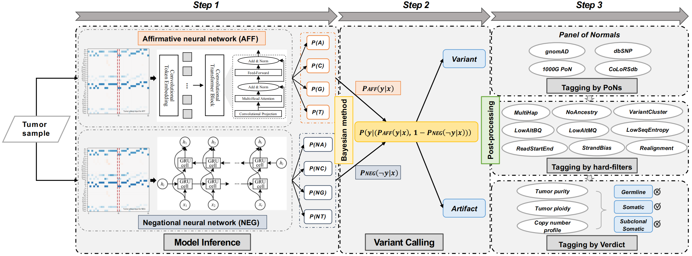
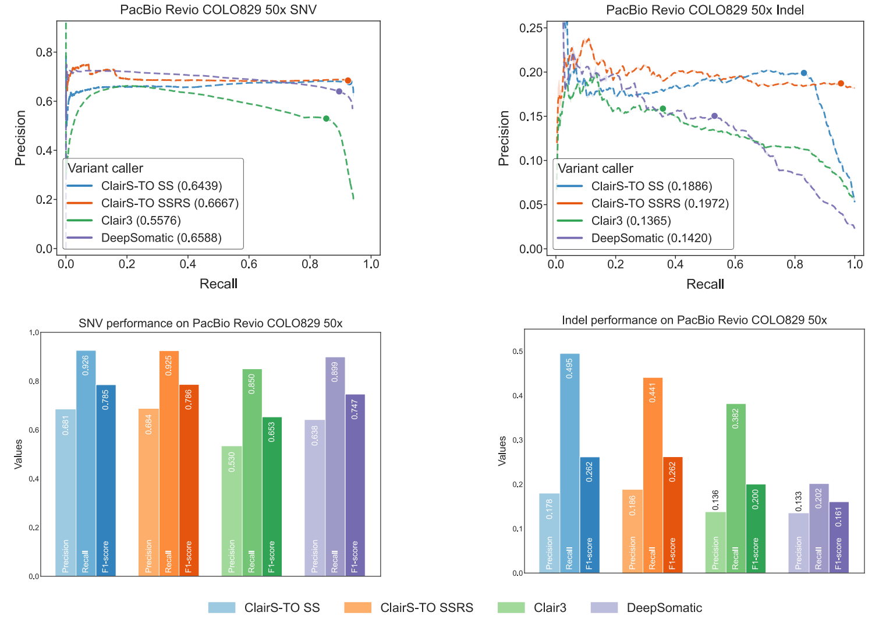

<div align="center">
    
</div>

# ClairS-TO - a deep-learning method for long-read tumor-only somatic small variant calling

[](https://opensource.org/licenses/BSD-3-Clause) [](https://doi.org/10.5281/zenodo.17108224)


Contact: Ruibang Luo, Zhenxian Zheng, Lei Chen  
Email: {rbluo,zxzheng,lchen}@cs.hku.hk 

------

## Introduction

ClairS-TO (Somatic Tumor-Only) is a tool in the Clair series to support long-read tumor-only somatic small variant calling.

Without a matched normal sample, non-somatic noises cannot be identified by finding common signals between a paired tumor and normal. The variant caller itself needs to be more proficient in telling somatic variants apart from germline variants and background noises.

In ClairS-TO, we use an ensemble of two disparate neural networks that were trained from the same samples but for two exact opposite tasks – an affirmative neural network (AFF) that determines how likely a candidate is a somatic variant – *P<sub>AFF</sub>(y|x)*, and a negational neural network (NEG) that determines how likely a candidate is not a somatic variant – *P<sub>NEG</sub>(&not;y|x)*. A posterior probability – *P(y|(P<sub>AFF</sub>(y|x), 1 - P<sub>NEG</sub>(&not;y|x)))* – for each variant candidate is calculated from the outputs of the two networks and prior probabilities derived from the training samples.

Below is a somatic variant calling workflow of ClairS-TO.


Like other tumor-only somatic variant callers, ClairS-TO also applies multiple post-calling filters, including 1) nine hard-filters, 2) four public plus any number of user-supplied panels of normals (PoNs), and 3) a module that statistically separates somatic and germline variants using estimated tumor purity and copy number profile.

A preprint describing ClairS-TO's algorithms and results is at [bioRxiv](https://www.biorxiv.org/content/10.1101/2025.03.10.642523v1).

For somatic variant calling using paired tumor/normal samples, please try [ClairS](https://github.com/HKU-BAL/ClairS).

------

## Performance figures

### ONT Q20+ chemistry performance
#### Performance comparison between ClairS-TO (SS and SSRS model), Clair3, and DeepSomatic of the Precision-Recall curves (a) and the best achievable F1-score, along with the corresponding precision and recall (b), at 25-, 50-, and 75-fold tumor coverages of ONT COLO829 dataset. 


#### Performance comparison between ClairS-TO (SS and SSRS model), Clair3, and DeepSomatic of the Precision-Recall curves (a) and the best achievable F1-score, along with the corresponding precision and recall (b), at 25-, 50-, and 75-fold tumor coverages of ONT HCC1395 dataset.


### PacBio Revio performance
#### Performance comparison between ClairS-TO (SS and SSRS model), Clair3, and DeepSomatic at 50-fold tumor coverage of PacBio Revio COLO829 dataset. 



### Illumina performance
#### Performance comparison between ClairS-TO (SS and SSRS model), Mutect2, Octopus, Pisces, and DeepSomatic at 50-fold tumor coverage of Illumina COLO829 dataset. 


## Contents
- [Latest Updates](#latest-updates)
- [Quick Demo](#quick-demo)
- [Pre-trained Models](#pre-trained-models)
- [Installation](#installation)
  - [Option 1. Docker pre-built image](#option-1--docker-pre-built-image)
  - [Option 2. Singularity](#option-2-singularity)
  - [Option 3. Build a micromamba (or anaconda) virtual environment](#option-3-build-a-micromamba-or-anaconda-virtual-environment)
  - [Option 4. Docker Dockerfile](#option-4-docker-dockerfile)
- [Usage](#usage)
- [Tagging non-somatic variant using panel of normals](#tagging-non-somatic-variant-using-panel-of-normals)
- [Disclaimer](#disclaimer)

------

## Latest Updates

*v0.4.2 (Oct. 13, 2025)* : Added safe checking when ClairS-TO got any non-zero returns ([#40](https://github.com/HKU-BAL/ClairS-TO/issues/40)).

*v0.4.1 (Sep. 2, 2025)* : 1. Fixed an alternative allele representation issue when a deletion is immediately followed by an insertion ([#38](https://github.com/HKU-BAL/ClairS-TO/issues/38)). 2. Fixed a VCF output issue when no variant was found ([#35](https://github.com/HKU-BAL/ClairS-TO/issues/35)). 3. Added checking when loading model to meet the latest pytorch version ([#37](https://github.com/HKU-BAL/ClairS-TO/issues/37)).

*v0.4.0 (Mar. 10, 2025)* : This is the version used for the preprint. 1. Fixed a numerical bug in calculating the joint probability of both networks, leading to a very sightly improved overall performance.

*v0.3.1 (Nov. 29, 2024)* : Added `ssrs` model for PacBio Revio (`hifi_revio_ssrs`) and Illumina (`ilmn_ssrs`) platforms.

*v0.3.0 (Oct. 11, 2024)* : This version is a major update. The new features and benchmarks are explained in a technical note titled [“Improving the performance of ClairS and ClairS-TO with new real cancer cell-line datasets and PoN”](https://github.com/HKU-BAL/ClairS/blob/main/docs/Improving_the_performance_of_ClairS_and_ClairS-TO_with_new_real_cancer_cell-line_datasets_and_PoN.pdf). A summary of changes: 1. Starting from this version, ClairS-TO will provide two model types. `ssrs` is a model trained initially with synthetic samples and then real samples augmented (e.g., `ont_r10_dorado_sup_5khz_ssrs`), `ss` is a model trained from synthetic samples (e.g., `ont_r10_dorado_sup_5khz_ss`). The `ssrs` model provides better performance and fits most usage scenarios. `ss` model can be used when missing a cancer-type in model training is a concern. In v0.3.0, four real cancer cell-line datasets (HCC1937, HCC1954, H1437, and H2009) covering two cancer types (breast cancer, lung cancer) published by [Park et al.](https://www.biorxiv.org/content/10.1101/2024.08.16.608331v1) were used for `ssrs` model training. 2. Added using [CoLoRSdb](https://zenodo.org/records/13145123) (Consortium of Long Read Sequencing Database) as a PoN for tagging non-somatic variant. The idea was inspired by [Park et al., 2024](https://www.biorxiv.org/content/10.1101/2024.08.16.608331v1). The F1-score improved by ~10-20% for both SNV and Indel by using CoLoRSdb. 3. Added tagging indels at sequence with low entropy as `LowSeqEntropy`. 4. Added the `--indel_min_af` option and adjusted the default minimum allelic fraction requirement to 0.1 for Indels in ONT platform. 5. Removed limiting Indel calling to only confident and necessary regions (whole genome - GIAB stratification v3.3 all difficult regions + CMRG v1.0 regions). The practice was started in v0.1.0, and is deemed unnecessary and removed in v0.3.0. User can use `--calling_indels_only_in_these_regions` option to specify Indel calling regions.

*v0.2.0 (Jul. 12, 2024)*: 1. Added a module called `verdict` to statistically classify a called variant into either a germline, somatic, or subclonal somatic variant based on the copy number alterations (CNA) profile and tumor purity estimation. To disable, use `--disable_verdict` option. Please check out more technical details about Verdict [here](docs/verdict.md).

*v0.1.0 (Apr. 25, 2024)*: 1. Added support for somatic Indel calling. To disable, use `--disable_indel_calling` option. Indels are called only in the BED regions specified by the `--calling_indels_only_in_these_regions` option. The default regions are (whole genome - GIAB stratification v3.3 all difficult regions + CMRG v1.0 regions). 2. Added `--panel_of_normals_require_allele_matching` option that takes comma separated booleans to indicate whether to require allele matching for each of the PoNs given in `--panel_of_normals`. By default, allele matching is enabled when using germline variants sources (e.g., gnomAD, dbSNP) for non-somatic tagging, and is disabled when using panels (e.g., 1000G PoN). 3. Added multiple filters to remove as many spurious calls as possible. Including the use of i. phasing information: how good the alternative alleles are from a single haplotype after phasing ([Simpson, 2024](https://www.biorxiv.org/content/10.1101/2024.02.26.582089v1)); ii. ancestral haplotype support: can an ancestral haplotype be found for reads that contain the alternative allele ([Zheng et al., 2023](https://www.biorxiv.org/content/10.1101/2023.08.17.553778v1)); iii. BQ, MQ of the alternative allele reads; iv. variant position in read: whether the supporting alleles are gathered at the start or end of reads; v. strand bias; vi. realignment effect: for short read, whether both the count of supporting alt alleles and AF decreased after realignment. 4. Added `--qual_cutoff_phaseable_region` and `--qual_cutoff_unphaseable_region` to allow different qual cutoffs for tagging (as LowQual) the variants in the phaseable and unphaseable regions. Variants in unphaseable regions are suitable for a higher quality cutoff than those in the phaseable regions. 5. Added tags: i. `H` to indicate a variant is found in phaseable region; ii. `SB` showing the p-value of Fisher’s exact test on strand bias.

*v0.0.2 (Jan. 26, 2024)*: 1. Added ONT Guppy 5kHz HAC (`-p ont_r10_guppy_hac_5khz`) and Dorado 4kHz HAC (`-p ont_r10_dorado_hac_4khz`) models, check [here](#pre-trained-models) for more details. 2. Added `FAU`, `FCU`, `FGU`, `FTU`, `RAU`, `RCU`, `RGU`, and `RTU` tags for the count of forward/reverse strand reads supporting A/C/G/T. 3. Revamped the way how panel of normals (PoNs) are inputted. Population databases are also considered as PoNs, and users can disable default population databases and add multiple other PoNs. 4. Added `file` and `md5` information of the PoNs to the VCF output header. 5. Enabled somatic variant calling in sex chromosomes. 6. Fixed an issue that misses PoNs tagging for low-quality variants.

*v0.0.1 (Dec. 4, 2023)*: Initial release for early access.

---

## Quick Demo

- Oxford Nanopore (ONT) [Q20+](https://nanoporetech.com/q20plus-chemistry) data as input, see [ONT Quick Demo](docs/ont_quick_demo.md).
- PacBio HiFi Revio data as input, see [PacBio HiFi Quick Demo](docs/pacbio_hifi_quick_demo.md).
- Illumina NGS data as input, see [Illumina Quick Demo](docs/illumina_quick_demo.md).

### Quick start

After following [installation](#installation), you can run ClairS-TO with one command:

```bash
./run_clairs_to -T tumor.bam -R ref.fa -o output -t 8 -p ont_r10_guppy_sup_4khz

## Final SNV output VCF file: output/snv.vcf.gz
## Final Indel output VCF file: output/indel.vcf.gz
```

Check [Usage](#Usage) for more options.

------

## Pre-trained Models

ClairS-TO trained both Affirmative and Negational models using GIAB samples, and carry on benchmarking on HCC1395 tumor sample dataset. All models were trained with chr20 excluded (including only chr1-19, 21, 22). 

|               Platform               |        Model name         |      Chemistry /Instruments      | Basecaller | Latest update |     Option (`-p/--platform`)      |   Reference   |  Aligner   |
|:------------------------------------:|:-------------------------:|:--------------------------------:|:----------:|:-------------:|:---------------------------------:|:-------------:|:----------:|
|           ONT <sup>1</sup>           | r1041_e82_400bps_sup_v420 |          R10.4.1, 5khz           | Dorado SUP | Nov. 20, 2024 |  `ont_r10_dorado_sup_5khz_ssrs`   | GRCh38_no_alt |  Minimap2  |
|           ONT <sup>1</sup>           | r1041_e82_400bps_sup_v420 |          R10.4.1, 5khz           | Dorado SUP | Nov. 10, 2023 |   `ont_r10_dorado_sup_5khz_ss`    | GRCh38_no_alt |  Minimap2  |
|                 ONT                  | r1041_e82_400bps_sup_v420 |          R10.4.1, 5khz           | Dorado SUP | Nov. 10, 2023 |     `ont_r10_dorado_sup_5khz`     | GRCh38_no_alt |  Minimap2  |
|                 ONT                  | r1041_e82_400bps_sup_v410 |          R10.4.1, 4khz           | Dorado SUP | Nov. 10, 2023 |     `ont_r10_dorado_sup_4khz`     | GRCh38_no_alt |  Minimap2  |
|                 ONT                  | r1041_e82_400bps_hac_v410 |          R10.4.1, 4khz           | Dorado HAC | Jan. 19, 2024 |     `ont_r10_dorado_hac_4khz`     | GRCh38_no_alt |  Minimap2  |
|                 ONT                  | r1041_e82_400bps_sup_g615 |          R10.4.1, 4khz           | Guppy6 SUP | Nov. 10, 2023 |     `ont_r10_guppy_sup_4khz`      | GRCh38_no_alt |  Minimap2  |
|                 ONT                  | r1041_e82_400bps_hac_g657 |          R10.4.1, 5khz           | Guppy6 HAC | Jan. 21, 2024 |     `ont_r10_guppy_hac_5khz`      | GRCh38_no_alt |  Minimap2  |
|        Illumina <sup>1</sup>         |           ilmn            |          NovaSeq/HiseqX          |     -      | Nov. 20, 2024 |            `ilmn_ssrs`            |    GRCh38     |  BWA-MEM   |
|        Illumina <sup>1</sup>         |           ilmn            |          NovaSeq/HiseqX          |     -      | Nov. 10, 2023 |             `ilmn_ss`             |    GRCh38     |  BWA-MEM   |
|               Illumina               |           ilmn            |          NovaSeq/HiseqX          |     -      | Nov. 10, 2023 |              `ilmn`               |    GRCh38     |  BWA-MEM   |
|       PacBio HiFi <sup>1</sup>       |        hifi_revio         | Revio with SMRTbell prep kit 3.0 |     -      | Nov. 20, 2024 |         `hifi_revio_ssrs`         | GRCh38_no_alt |  Minimap2  |
|       PacBio HiFi <sup>1</sup>       |        hifi_revio         | Revio with SMRTbell prep kit 3.0 |     -      | Nov. 10, 2023 |          `hifi_revio_ss`          | GRCh38_no_alt |  Minimap2  |
|             PacBio HiFi              |        hifi_revio         | Revio with SMRTbell prep kit 3.0 |     -      | Nov. 10, 2023 |           `hifi_revio`            | GRCh38_no_alt |  Minimap2  |

**Caveats <sup>1</sup>**: Starting from v0.3.0 version, ClairS-TO will provide two model types. `ssrs` is a model trained initially with synthetic samples and then real samples augmented (e.g., `ont_r10_dorado_sup_5khz_ssrs`, `ilmn_ssrs`, `hifi_revio_ssrs`), `ss` is a model trained from synthetic samples (e.g., `ont_r10_dorado_sup_5khz_ss`, `ilmn_ss`, `hifi_revio_ss`). The `ssrs` model provides better performance and fits most usage scenarios. `ss` model can be used when missing a cancer-type in model training is a concern. In v0.3.0, four real cancer cell-line datasets (HCC1937, HCC1954, H1437, and H2009) covering two cancer types (breast cancer, lung cancer) published by [Park et al.](https://www.biorxiv.org/content/10.1101/2024.08.16.608331v1) were used for `ssrs` model training.

------

## Installation

### Option 1.  Docker pre-built image

A pre-built docker image is available at [DockerHub](https://hub.docker.com/r/hkubal/clairs-to). 

**Caution**: Absolute path is needed for both `INPUT_DIR` and `OUTPUT_DIR` in docker. 

```bash
docker run -it \
  -v ${INPUT_DIR}:${INPUT_DIR} \
  -v ${OUTPUT_DIR}:${OUTPUT_DIR} \
  hkubal/clairs-to:latest \
  /opt/bin/run_clairs_to \
  --tumor_bam_fn ${INPUT_DIR}/tumor.bam \      ## use your tumor bam file name here
  --ref_fn ${INPUT_DIR}/ref.fa \               ## use your reference file name here
  --threads ${THREADS} \                       ## maximum threads to be used
  --platform ${PLATFORM} \                     ## options: {ont_r10_dorado_sup_4khz, ont_r10_dorado_hac_4khz, ont_r10_dorado_sup_5khz, ont_r10_dorado_sup_5khz_ss, ont_r10_dorado_sup_5khz_ssrs, ont_r10_guppy_sup_4khz, ont_r10_guppy_hac_5khz, ilmn, ilmn_ss, ilmn_ssrs, hifi_revio, hifi_revio_ss, hifi_revio_ssrs}
  --output_dir ${OUTPUT_DIR}                   ## output path prefix 
```

Check [Usage](#Usage) for more options.

### Option 2. Singularity

**Caution**: Absolute path is needed for both `INPUT_DIR` and `OUTPUT_DIR` in singularity. 

```bash
INPUT_DIR="[YOUR_INPUT_FOLDER]"        # e.g. /home/user1/input (absolute path needed)
OUTPUT_DIR="[YOUR_OUTPUT_FOLDER]"      # e.g. /home/user1/output (absolute path needed)
mkdir -p ${OUTPUT_DIR}

conda config --add channels defaults
conda create -n singularity-env -c conda-forge singularity -y
conda activate singularity-env

# singularity pull docker pre-built image
singularity pull docker://hkubal/clairs-to:latest

# run the sandbox like this afterward
singularity exec \
  -B ${INPUT_DIR},${OUTPUT_DIR} \
  clairs-to_latest.sif \
  /opt/bin/run_clairs_to \
  --tumor_bam_fn ${INPUT_DIR}/tumor.bam \      ## use your tumor bam file name here
  --ref_fn ${INPUT_DIR}/ref.fa \               ## use your reference file name here
  --threads ${THREADS} \                       ## maximum threads to be used
  --platform ${PLATFORM} \                     ## options: {ont_r10_dorado_sup_4khz, ont_r10_dorado_hac_4khz, ont_r10_dorado_sup_5khz, ont_r10_dorado_sup_5khz_ss, ont_r10_dorado_sup_5khz_ssrs, ont_r10_guppy_sup_4khz, ont_r10_guppy_hac_5khz, ilmn, ilmn_ss, ilmn_ssrs, hifi_revio, hifi_revio_ss, hifi_revio_ssrs}
  --output_dir ${OUTPUT_DIR} \                 ## output path prefix
  --conda_prefix /opt/micromamba/envs/clairs-to
```

### Option 3. Build a micromamba (or anaconda) virtual environment

Check here to install the tools step by step.

**Use micromamba (recommended)**:

Please install micromamba using the official [guide](https://mamba.readthedocs.io/en/latest/micromamba-installation.html) or using the commands below:

```bash
wget -O linux-64_micromamba-1.5.1-2.tar.bz2 https://micro.mamba.pm/api/micromamba/linux-64/latest
mkdir micromamba
tar -xvjf linux-64_micromamba-1.5.1-2.tar.bz2 -C micromamba
cd micromamba
./bin/micromamba shell init -s bash -r .
source ~/.bashrc
```

**Or use anaconda**:

Please install anaconda using the official [guide](https://docs.anaconda.com/anaconda/install) or using the commands below:

```bash
wget https://repo.anaconda.com/miniconda/Miniconda3-latest-Linux-x86_64.sh
chmod +x ./Miniconda3-latest-Linux-x86_64.sh 
./Miniconda3-latest-Linux-x86_64.sh
```

**Install ClairS-TO using micromamba step by step:**

```bash
# create and activate an environment named clairs-to
# install pypy and packages in the environment
# for micromamba
micromamba create -n clairs-to -c bioconda -c pytorch -c conda-forge pytorch tqdm clair3 bcftools einops scipy scikit-learn python=3.9.0 -y
micromamba activate clairs-to

## for anaconda 
#conda create -n clairs-to -c bioconda -c pytorch -c conda-forge pytorch tqdm clair3 bcftools einops python=3.9.0 -y
#source activate clairs-to

git clone https://github.com/HKU-BAL/ClairS-TO.git
cd ClairS-TO

# make sure in clairs-to environment
# download pre-trained models and other resources
echo ${CONDA_PREFIX}
mkdir -p ${CONDA_PREFIX}/bin/clairs-to_models
mkdir -p ${CONDA_PREFIX}/bin/clairs-to_databases
mkdir -p ${CONDA_PREFIX}/bin/clairs-to_cna_data
wget http://www.bio8.cs.hku.hk/clairs-to/models/clairs-to_models.tar.gz
wget http://www.bio8.cs.hku.hk/clairs-to/databases/clairs-to_databases.tar.gz
wget http://www.bio8.cs.hku.hk/clairs-to/cna_data/reference_files.tar.gz
tar -zxvf clairs-to_models.tar.gz -C ${CONDA_PREFIX}/bin/clairs-to_models/
tar -zxvf clairs-to_databases.tar.gz -C ${CONDA_PREFIX}/bin/clairs-to_databases/
tar -zxvf reference_files.tar.gz -C ${CONDA_PREFIX}/bin/clairs-to_cna_data/

#CLAIRSTO_PATH=`pwd`

## to enable realignment module
#sudo apt install g++ libboost-all-dev -y
#cd ${CLAIRSTO_PATH}/src/realign && g++ -std=c++14 -O1 -shared -fPIC -o realigner ssw_cpp.cpp ssw.c realigner.cpp && g++ -std=c++11 -shared -fPIC -o debruijn_graph -O3 debruijn_graph.cpp

## to install allele counter for verdict module
#sudo apt install curl zlib1g-dev libbz2-dev liblzma-dev libcurl4-openssl-dev gcc -y
#cd ${CLAIRSTO_PATH}/src/verdict/allele_counter && chmod +x ./setup.sh && /bin/bash ./setup.sh ${CLAIRSTO_PATH}/src/verdict/allele_counter

#cd ${CLAIRSTO_PATH}

./run_clairs_to --help
```

### Option 4. Docker Dockerfile

This is the same as Option 1 except that you are building a docker image yourself. Please refer to Option 1 for usage. 

```bash
git clone https://github.com/HKU-BAL/ClairS-TO.git
cd ClairS-TO

# build a docker image named hkubal/clairs-to:latest
# might require docker authentication to build docker image
docker build -f ./Dockerfile -t hkubal/clairs-to:latest .

# run the docker image like Option 1
docker run -it hkubal/clairs-to:latest /opt/bin/run_clairs_to --help
```

------

## Usage

### General Usage

```bash
./run_clairs_to \
  --tumor_bam_fn ${INPUT_DIR}/tumor.bam \    ## use your tumor bam file name here
  --ref_fn ${INPUT_DIR}/ref.fa \             ## use your reference file name here
  --threads ${THREADS} \                     ## maximum threads to be used
  --platform ${PLATFORM} \                   ## options: {ont_r10_dorado_sup_4khz, ont_r10_dorado_hac_4khz, ont_r10_dorado_sup_5khz, ont_r10_dorado_sup_5khz_ss, ont_r10_dorado_sup_5khz_ssrs, ont_r10_guppy_sup_4khz, ont_r10_guppy_hac_5khz, ilmn, ilmn_ss, ilmn_ssrs, hifi_revio, hifi_revio_ss, hifi_revio_ssrs}
  --output_dir ${OUTPUT_DIR}                 ## output path prefix
 
## Final SNV output VCF file: output/snv.vcf.gz
## Final Indel output VCF file: output/indel.vcf.gz
```

### Options

**Required parameters:**

```bash
  -T, --tumor_bam_fn TUMOR_BAM_FN   Tumor BAM file input. The input file must be samtools indexed.
  -R, --ref_fn FASTA                Reference file input. The input file must be samtools indexed.
  -o, --output_dir OUTPUT_DIR       VCF output directory.
  -t, --threads THREADS             Max threads to be used.
  -p, --platform PLATFORM           Select the sequencing platform of the input. Possible options {ont_r10_dorado_sup_4khz, ont_r10_dorado_hac_4khz, ont_r10_dorado_sup_5khz, ont_r10_dorado_sup_5khz_ss, ont_r10_dorado_sup_5khz_ssrs, ont_r10_guppy_sup_4khz, ont_r10_guppy_hac_5khz, ilmn, ilmn_ss, ilmn_ssrs, hifi_revio, hifi_revio_ss, hifi_revio_ssrs}.
```

**Commonly used parameters:**

```bash
  -s SAMPLE_NAME, --sample_name SAMPLE_NAME
                        Define the sample name to be shown in the VCF file. Default: SAMPLE.
  -c CTG_NAME, --ctg_name CTG_NAME                                                                                                                                                                         
                        The name of the contigs to be processed. Split by ',' for multiple contigs. Default: all contigs will be processed.
  --include_all_ctgs    Call variants on all contigs, otherwise call in chr{1..22,X,Y} and {1..22,X,Y}.                                                                
  -r REGION, --region REGION                                                                                                                                                                               
                        A region to be processed. Format: `ctg_name:start-end` (start is 1-based, including both end positions).                                                                                                         
  -b BED_FN, --bed_fn BED_FN                                                                                                                                                                               
                        Path to a BED file. Call variants only in the provided BED regions.                                                                                                                
  -G VCF_FN, --genotyping_mode_vcf_fn VCF_FN                                                                                                                               
                        VCF file input containing candidate sites to be genotyped. Variants will only be called at the sites in the VCF file if provided.                                                  
  -H VCF_FN, --hybrid_mode_vcf_fn VCF_FN                                                                                                                                           
                        Enable hybrid calling mode that combines the de novo calling results and genotyping results at the positions in the VCF file given.
  --print_ref_calls     Show reference calls (0/0) in VCF file in genotyping or hybrid mode.
  --disable_indel_calling
                        Disable Indel calling. Default: Enabled.
  --snv_min_af FLOAT
                        Minimal SNV AF required for a variant to be called. Decrease SNV_MIN_AF might increase a bit of sensitivity, but in trade of precision, speed and accuracy. Default: 0.05.
  --indel_min_af FLOAT
                        Minimal Indel AF required for a variant to be called. Default: 0.1.
  --min_coverage INT
                        Minimal coverage required for a variant to be called. Default: 4.
  -q INT, --qual INT    If set, variants with >INT will be tagged as PASS, or LowQual otherwise. Default: ONT - 8 , PacBio HiFi - 8, Illumina - 4.
  --qual_cutoff_phaseable_region INT
                        If set, variants called in phaseable regions with >INT will be tagged as PASS, or LowQual otherwise. Supersede by `--qual`.
  --qual_cutoff_unphaseable_region INT
                        If set, variants called in unphaseable regions with >INT will be tagged as PASS, or LowQual otherwise. Supersede by `--qual`.
  --panel_of_normals FILENAMES
                        The path of the panel of normals (PoNs) used for tagging non-somatic variants. Split by ',' if using multiple PoNs. Default: 'gnomad.r2.1.af-ge-0.001.sites.vcf.gz,dbsnp.b138.non-somatic.sites.vcf.gz,1000g-pon.sites.vcf.gz,CoLoRSdb.GRCh38.v1.1.0.deepvariant.glnexus.af-ge-0.001.vcf.gz'.
  --panel_of_normals_require_allele_matching BOOLEANS
                        Use together with `--panel_of_normals`. Whether to require allele matching for each PoN. Split by ',' if using multiple PoNs. Default: 'True,True,False,False'.
  --snv_output_prefix PATH_PREFIX
                        Prefix for SNV output VCF filename. Default: snv.
  --indel_output_prefix PATH_PREFIX
                        Prefix for Indel output VCF filename. Default: indel.
  --call_indels_only_in_these_regions BED_FN
                        Call Indel only in the provided regions. Supersede by `--bed_fn`. To call Indel in the whole genome, input a BED covering the whole genome.                    
  --do_not_print_nonsomatic_calls
                        Do not print those non-somatic variants tagged by `--panel_of_normals`.
```

**Other parameters:**

```bash
  --snv_pileup_affirmative_model_path PATH                                                                                                                                            
                        Specify the path to your own SNV pileup affirmative model.                                                                                                  
  --snv_pileup_negational_model_path PATH                                                                                                                                              
                        Specify the path to your own SNV pileup negational model. 
  --indel_pileup_affirmative_model_path PATH
                        Specify the path to your own Indel pileup affirmative model.
  --indel_pileup_negational_model_path PATH
                        Specify the path to your own Indel pileup negational model.
  -d, --dry_run         Print the commands that will be ran, but do not run them.
  --chunk_size INT
                        The size of each chuck for parallel processing. Default: 5000000.
  --remove_intermediate_dir
                        Remove the intermediate directory before finishing to save disk space.
  --python PATH         Absolute path of python, python3 >= 3.9 is required.
  --pypy PATH           Absolute path of pypy3, pypy3 >= 3.6 is required.
  --samtools PATH       Absolute path of samtools, samtools version >= 1.10 is required.
  --parallel PATH       Absolute path of parallel, parallel >= 20191122 is required.
  --longphase PATH
                        Absolute path of longphase, longphase >= 1.3 is required.
  --whatshap PATH       Absolute path of whatshap, whatshap >= 1.0 is required.
  --use_longphase_for_intermediate_phasing
                        Use longphase for intermediate phasing.
  --use_whatshap_for_intermediate_phasing
                        Use whatshap for phasing.
  --use_longphase_for_intermediate_haplotagging USE_LONGPHASE_FOR_INTERMEDIATE_HAPLOTAGGING
                        Use longphase instead of whatshap for intermediate haplotagging.
  --disable_intermediate_phasing
                        Disable intermediate phasing, runs faster but reduces precision.
  --disable_nonsomatic_tagging
                        Disable non-somatic variants tagging and ignore `--panel_of_normals`.
  --disable_verdict
                        Disable using verdict to tag the variants in CNA regions. We suggest using the parameter only for sample with tumor purity estimation lower than 0.8. Default: Enabled.                                    
```

#### Call Variants in one or multiple chromosomes using the `-C/--ctg_name` parameter

```bash
./run_clairs_to -T tumor.bam -R ref.fa -o output -t 8 -p ont_r10_guppy_sup_4khz -C chr21,chr22
```

#### Call Variants in one specific region using the `-r/--region` parameter

```bash
./run_clairs_to -T tumor.bam -R ref.fa -o output -t 8 -p ont_r10_guppy_sup_4khz -r chr20:1000000-2000000
```

#### Call Variants at interested variant sites (genotyping) using the `-G/--genotyping_mode_vcf_fn` parameter

```bash
./run_clairs_to -T tumor.bam -R ref.fa -o output -t 8 -p ont_r10_guppy_sup_4khz -G input.vcf
```

#### Call Variants in the BED regions using the `-B/--bed_fn` parameter

We highly recommended using BED file to define multiple regions of interest like:

```shell
echo -e "${CTG1}\t${START_POS_1}\t${END_POS_1}" > input.bed
echo -e "${CTG2}\t${START_POS_2}\t${END_POS_2}" >> input.bed
...
```

Then:

```bash
./run_clairs_to -T tumor.bam -R ref.fa -o output -t 8 -p ont_r10_guppy_sup_4khz -B input.bed
```

------

## Tagging non-somatic variant using panels of normals (PoNs)

ClairS-TO by default tags variants if they exist in provided panels of normals (PoNs, i.e., `gnomad.r2.1.af-ge-0.001.sites.vcf.gz`, `dbsnp.b138.non-somatic.sites.vcf.gz`, `1000g-pon.sites.vcf.gz`, and `CoLoRSdb.GRCh38.v1.1.0.deepvariant.glnexus.af-ge-0.001.vcf.gz`), and pass the filters listed in the table below. 

Users can also use their own PoNs for tagging using the `--panel_of_normals` option. 

Particularly, if the `--panel_of_normals` option is not specified, the four default PoNs will be included. And if users want to use all/part/none of the default PoNs as well as their own PoNs, corresponding file paths of the default PoNs (i.e., `${CONDA_PREFIX}/bin/clairs-to_databases/gnomad.r2.1.af-ge-0.001.sites.vcf.gz`, `${CONDA_PREFIX}/bin/clairs-to_databases/dbsnp.b138.non-somatic.sites.vcf.gz`, `${CONDA_PREFIX}/bin/clairs-to_databases/1000g-pon.sites.vcf.gz`, and `${CONDA_PREFIX}/bin/clairs-to_databases/CoLoRSdb.GRCh38.v1.1.0.deepvariant.glnexus.af-ge-0.001.vcf.gz`), and their own PoNs, should be included in the `--panel_of_normals` option, split by `,`. 

In addition, we recommend using `--panel_of_normals_require_allele_matching` option that takes comma separated booleans to indicate whether to require allele matching for each of the PoNs given in `--panel_of_normals`. By default, allele matching is enabled when using germline variants sources (e.g., gnomAD, dbSNP) for non-somatic tagging, and is disabled when using panels (e.g., 1000G PoN, CoLoRSdb).

| Default PoNs |                                                     URL                                                      |                         Source                         |                                                    Source URL                                                    |        Last visited         | Total #Variants |        Filters         | #Variants used for tagging | Remaining Columns in the input   |
|:------------:|:------------------------------------------------------------------------------------------------------------:|:------------------------------------------------------:|:----------------------------------------------------------------------------------------------------------------:|:---------------------------:|:---------------:|:----------------------:|:--------------------------:|:--------------------------------:|
|    PoN 1     |              http://www.bio8.cs.hku.hk/clairs-to/databases/gnomad.r2.1.af-ge-0.001.sites.vcf.gz              |                      GATK gnomAD                       |            https://storage.googleapis.com/gatk-best-practices/somatic-hg38/af-only-gnomad.hg38.vcf.gz            |  July 10, 2023 PM10∶34∶07   |   268,225,276   | Sites with AF ≥ 0.001  |         35,551,905         |     #CHROM  POS ID  REF ALT      |
|    PoN 2     |              http://www.bio8.cs.hku.hk/clairs-to/databases/dbsnp.b138.non-somatic.sites.vcf.gz               |                       GATK dbSNP                       | https://storage.googleapis.com/genomics-public-data/resources/broad/hg38/v0/Homo_sapiens_assembly38.dbsnp138.vcf |  July 10, 2023 PM10∶42∶22   |   60,691,395    |   Non-Somatic sites    |         60,683,019         |     #CHROM  POS ID  REF ALT      |
|    PoN 3     |                     http://www.bio8.cs.hku.hk/clairs-to/databases/1000g-pon.sites.vcf.gz                     |                     GATK 1000G PoN                     |              https://storage.googleapis.com/gatk-best-practices/somatic-hg38/1000g_pon.hg38.vcf.gz               |  July 10, 2023 PM10∶31∶32   |    2,609,566    |       All sites        |         2,609,566          |     #CHROM  POS ID  REF ALT      |
|    PoN 4     | http://www.bio8.cs.hku.hk/clairs-to/databases/CoLoRSdb.GRCh38.v1.1.0.deepvariant.glnexus.af-ge-0.001.vcf.gz  | Consortium of Long Read Sequencing Database (CoLoRSdb) |           https://zenodo.org/records/13145123/files/CoLoRSdb.GRCh38.v1.1.0.deepvariant.glnexus.vcf.gz            | August 21, 2024 PM10∶36∶10  |   49,550,902    | Sites with AF ≥ 0.001  |         41,175,834         |     #CHROM  POS ID  REF ALT      |

------

## Disclaimer

NOTE: the content of this research code repository (i) is not intended to be a medical device; and (ii) is not intended for clinical use of any kind, including but not limited to diagnosis or prognosis.
